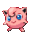

# jigglypuff
Jigglypuff is a hyper.js theme プリン

<h1 align="center">
  <br/>
</h1>

## Install

### Using the plugin manager - `hyper`

Firstly, ensure you have [Hyper](https://github.com/zeit/hyper) installed in your system.

Once done with that, install the `hyper-jigglypuff` theme.

```bash
# open your hyper terminal and type 
$ hyper i hyper-jigglypuff
```

## Usage

Once you have installed `hyper-jigglypuff`, it's time to set your favorite jigglypuff icon to your terminal tab (or hide it 🥺). By default the jigglypuff from the 5th generation will (wildly) appear, but you can change that.

Here is an example using the `3rd generation`  icon.

```js
config: {
    //...
    colors: {
    //...
    },
    // Jigglypuff theme
    jigglypuffHide: 'false', // default
    jigglypuffVersion: 'iii', // default is v
    //...
}
```

## Options

### `jigglypuffHide`

Assign false if you want to hide the Jigglypuff icon from your terminal header.

- `jigglypuffHide: 'true'` - it will hide
- `jigglypuffHide: 'false'` - (default value), it will not hide :)

### `jigglypuffVersion`

Use this option to change the jigglypuff icon generation. 

The variations are:

* `jigglypuffVersion: small` 
* `jigglypuffVersion: i` 
* `jigglypuffVersion: ii` 
* `jigglypuffVersion: iii` 
* `jigglypuffVersion: iv` 
* `jigglypuffVersion: v` 
* `jigglypuffVersion: v-big` 

---

### Inspiration

- https://github.com/klaussinani/hyper-pokemon

### Images

- https://bulbapedia.bulbagarden.net/wiki/Jigglypuff_(Pok%C3%A9mon)
- https://archives.bulbagarden.net/wiki/Category:Jigglypuff

### Extra

#### How to change terminal title (Mac OS) and ohmyzsh

Go to your .zshrc and add:

```
DISABLE_AUTO_TITLE="true"
echo -en "\e]2; whatever you want here $@\a"
```